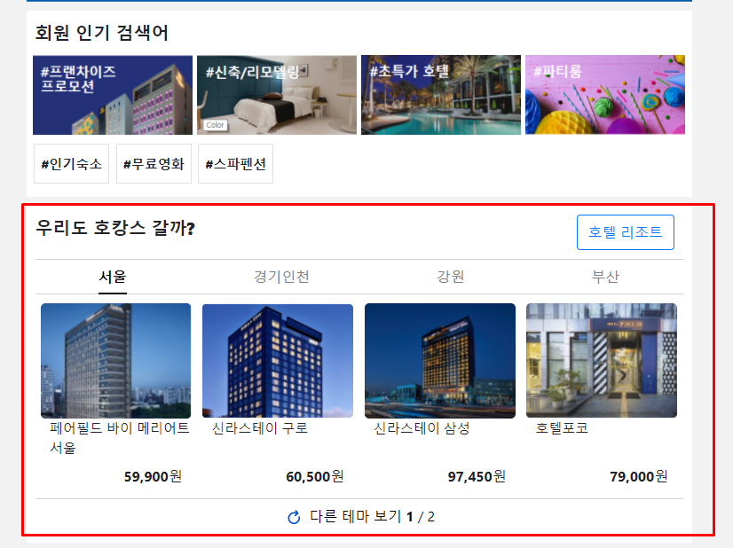
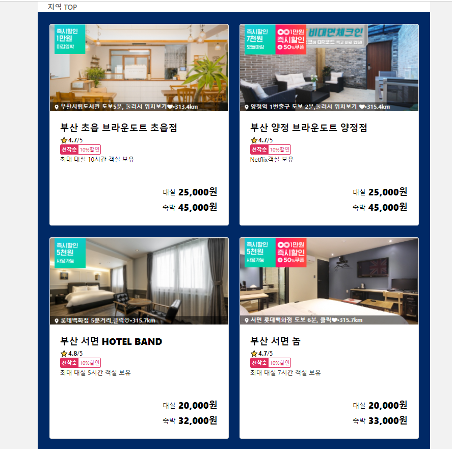

# JSP-Yanolja-Project

안녕하세요. 진경빈입니다.   

이번에는 2021-01-22일 ~ 2021~01-29일간 야놀자 홈페이지를 JSP를 이용하여 제작했습니다.

# 목차
- 홈페이지 시연 영상
- 사용 기술
	- Front end
	- Back end
	- 배포
	- 도식화
 - 개발 환경 
 - 화면별 기능설명
 - DB 초기 데이터
 -  블로그 주소
  
# 홈페이지 시연영상

# 사용 기능
 
## Front end

  - JSP
  - CSS
  - JQuery
  - Bootstarp
  - Javascript
  
  ## Back end
  
  - MVC 패턴
     - Reflection
     - FrontContrlloer
     - Service
     - Model
     - Dto
     - DB
  - AJAX
  - MYSQL
  - 라이브러리
      - lombok
      - gson
      - jstl
      - mysql

## 배포
- AWS
- ubuntu
- Docker
- tomcat
- Mysql
  
## 도식화
 ###  MVC 패턴

 ### Reflection 
  

## 개발환경
- 개발언어 : JAVA
- IDE : STS, Vscode
- DB : Mysql 8.0
- WAS :  tomcat
- 배포 : AWS - Docker

## 페이지 화면별 주요 기능설명

###  1. Index페이지
### 모텔 페이지이동
 

  
   

### bootstrap - Carousel
 

  
   
  
### JQuery
 
 

 
 

### 2. 회원가입
- 닉네임 중복체크 - AJAX  [닉네임 사용가능시 비활성화]
- 필수 입력기능
  

 
 

## 3. 로그인
### 로그인된 User 정보 Session에 저장

 
 

## 4. 헤더
### 비로그인
   

### 로그인

 
 
 
## 5. 지역선택
-  전국 지역 리스트 - Bootstrapt-Dropdown 응용
-  2개지역 구현
   - 서울 - 강남 역삼 삼성 논현
   - 부산 - 서면/양정/초읍/부산시민공원
 
 
 

 
 

## 6. 지역 모텔 리스트 
### 체크인, 체크아웃 [bootstrap4 - datetimepicker]  
  - Linked Pickers
 
 
 
   
  

### 모텔 리스트 출력
   - 해당지역- 모텔리스트 Select
  - Select수만큼 javascript를 이용해 출력
  
  

 
 

## 7. 모텔 정보 출력
### 6번의 정보 출력
    - 체크인, 체크아웃, 모텔정보 
### 모텔 룸 사진 출력 [bootstrap - Carousel]

    
    
   
### 체크인 가능날짜 룸 타입 출력 [AJAX]

 
 
  
### 체크인 불가능 날짜 룸 타입 미출력 [AJAX]

 
 

## 8. 예약 하기
 -  예약시 typelist테이블의 reservation = 'true'로 update
    - reservation테이블 레코드 생성
    
- 7번의 정보 출력, Session 정보 출력
     - 체크인, 체크아웃, 모텔 정보, 모텔 룸 정보, User 정보
- 정보 입력
   -  체크인 시간, 체크아웃 시간
   -  대실, 숙박 선택

 
 

## 9. 예약리스트 보기
- 헤더의 예약리스트 보기 클릭
  -  세션의 ID로 조회하여 예약리스트 출력
  - 세션의 ID와 예약자의 ID 일치시 예약취소(삭제) [AJAX]
      -  예약 취소시 typelist테이블의 reservation = 'false'로 update
         -   reservation 테이블 레코드 삭제
   
   
  
 
 
  
### 예약리스트가 없을 때
 
 

### 예약 갯수만큼 출력가능
   
 

### admin계정 모든 User 예약정보 출력
 
 
  
  
 
## 10. 예약 불가 typelist 미출력 
- 모든방이 예약 가능할때
 
 

     
- VIP방이 예약 max일때
 
 
   
- 프리미엄방이 예약 max일때
  

 
 

 # DB 초기 데이터
- 양이 좀 있어서 블로그 주소를 첨부하겠습니다.
- https://blog.naver.com/skjin20800/222220476096

# 블로그 주소
블로그 주소 : https://blog.naver.com/skjin20800
